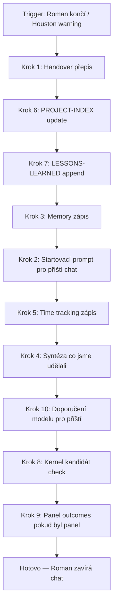

# PACTMAN — Cowork brief pro Codex (2026-05-16)

> Autor: Cowork (Claude, high reasoning), pro Romana a pro Codex.
> Účel: praktická, úplná a srozumitelná dokumentace PACTmana k dnešnímu dni — co reálně žije, co je návrh, co je historická stopa.
> Tohle není refactor ani redesign. Je to brief, aby Codex pochopil systém dřív, než do něj sáhne.
> Žádný governance core soubor nebyl při psaní změněn.

---

## 1. Executive summary

**PACTman jednou větou:** Tool-agnostic provozní operační systém pro Romana, který drží rozjeté projekty, paměť AI sezení a pravidla práce na jednom místě, takže Roman není administrátor svých vlastních AI nástrojů.

**Co dnes reálně funguje (stav 2026-05-16):**

- **Dispatcher** — `01_PACTman-system/governance/PROJECT-INDEX.md` jako jediná pravda o tom, jaký projekt zrovna žije, co blokuje, jaké soubory číst a v jakém pořadí.
- **Runtime kernel** — `RUNTIME-KERNEL.md` jako rychlý startup digest (Top 7 pravidel, tool routing, close-session minimum, OneDrive safety).
- **Plný zákon** — `LAWS.md` jako source of truth pravidel (K.0–K.15 Kernel + OS sekce). Plně čte se jen při sporu, audit, change.
- **Struktura projektů** — `PROJECT-STRUCTURE.md` v0.1, povinné STATUS / DECISIONS (ADR Nygard) / CHAT-HANDOVER + datované složky `YYMMDD-to*****/`. Postupný opportunistic rollout, ne big-bang.
- **Hlavní handover** — `pactman/CHAT-HANDOVER.md` jako AI session continuity (živá memory pro PACTman jako projekt).
- **Smoke test** — `PACTMAN-SMOKE-TEST.md`, 10 testovacích vstupů (T01–T10), read-only.
- **Health-check** — PowerShell `pactman-health-check.ps1`, denně, výstup `pactman/health/pactman-health-check-latest.md`. P0=0, P1=0, P2=1 (těsné C:).
- **Cowork Bridge protokol** — `pactman/docs/COWORK-BRIDGE-PROTOCOL.md`, formát pro každý úkol z Codex/PACTman → Cowork.
- **OS.4 close-session protokol** — 10 kroků v `LAWS.md`, ovládá uzavírání chatu (persistence first).
- **Time tracking** — `pactman/TIME-TRACKING.md`, append per session.
- **Skilly** — `.claude/skills/` (briefing, time-log, li-radar, byt-scrape, sparta, hd-kandidat, *****-test, safedx-blog-post, houston, …).
- **Memory pointers** — `pactman/MEMORY-INDEX.md` jako tool-agnostic mapa; Cowork auto-memory žije mimo OneDrive.

**Co je ještě návrh / experiment / shadow architecture:**

- **PACP — PACTman Architecture Change Protocol v0.1** (panelový výstup 2026-05-09 + Codex syntéza). Žádný core soubor needitován. Čeká Codex syntéza → návrh `PACP-PLAN.md` pro Iter 1 → Roman approval → sandbox start.
- **Health-check rozšíření o 10 PACP testů** (Test-PACPPlanContract, Test-GovernanceIntegrity, Test-IterationLoop…). Návrh, neimplementováno.
- **Agent Response Handoff rule** — návrh jednotného copy-paste bloku mezi agenty, draft v sandboxu.

**Co se nemá překopávat:**

- PROJECT-INDEX dispatcher logika (název = alias → soubory v pořadí).
- Top 7 pravidel v RUNTIME-KERNEL.
- OS.4 close-session 10-step pořadí.
- Sandbox pravidlo K.8 (nové funkce nejdřív v `pactman/sandbox/` nebo session složce).
- Tool routing matice (Cowork vs. Codex/Claude Code vs. browser).
- OneDrive safety (žádný `.git`/`node_modules`/`.next`/`.claude/worktrees` v OneDrive scope).
- K.13 Security First — secrets nikdy plain-text.

---

## 2. PACTman jako systém

**Účel:** Roman je OSVČ marketér, externí marketingový manažer pro SafeDX. Pracuje sám, AI je jeho multiplikátor. Pracuje paralelně v 15+ aktivních projektech (SDX content, ServerHotel landing, KB2 fakturace, HD// brand, FAIL moduly, byt, zahradka, London Calling, ICT web, Tier III audit, teambuilding…). Roman není architekt systému, není code reviewer, není dokumentátor. Roman je decision maker.

PACTman existuje proto, aby:

1. **Roman v každém novém chatu nezačínal od nuly.** AI si vezme z PROJECT-INDEX dispatcher entry pro projekt, načte 1–3 soubory a do 60 vteřin ví, kde se pokračuje.
2. **Roman neudržoval ručně dokumentaci.** AI píše handovery, indexy, lessons, time tracking automaticky při close-session. Roman validuje obsah (business / UX / value), ne administrativu.
3. **AI nedělala dvakrát stejnou chybu.** Memory + LESSONS-LEARNED + LAWS K.x čekají na slepé uličky, které už jednou přišly (file tool cache bug, mass migration, Houston discipline drift, A/B trap…).
4. **Roman se nehrabal v pravidlech.** Top 7 vleze do user_preferences. Plný zákon je k dispozici, ale nečte se na denní bázi.
5. **Práce zůstala recovery-ready.** Když OneDrive padne, sync se rozbije nebo `.git` zkorumpuje cache, existuje D: backup, snapshoty a recovery skripty.

**Hlavní principy:**

- **Tool-agnostic core.** Pravidla, dispatcher a struktura nejsou vázané na konkrétní AI nástroj. Cowork, Codex, Claude Code, GPT, browser AI — všichni čtou stejné soubory.
- **Persistence first.** Kontext nesmí umřít s chatem. Při zavření session se ukládá vše, co se nepamatuje samo (handover, index, time, lessons, memory).
- **Pravidla žijí v zákoně, funkce v Claude/Cowork.** LAWS.md = co se smí. Skilly + agenti = co se umí. Nemíchat.
- **Mechanická brána > self-discipline.** Když pravidlo závisí na tom, že si AI vzpomene, selže (K.0 token warning přepsán 3× než se z něj stal checkpoint). Brány patří na vstup (status row, decision tree, health-check), ne do mlhy běhu.
- **Iterace s mouchami > dokonalý plán v šuplíku.** Funkční MVP se opravuje za pochodu. Big-bang refactor je antifeature.
- **Žádné A/B v technické doméně.** Stack, library, architektura, workflow → AI doporučí 1 best practice. A/B krade Romanovi pozornost.

**Proč PACTman pomáhá líp než běžný chat s AI:**

| Bez PACT | S PACTmanem |
|---|---|
| Každý nový chat začíná onboardingem („řekni mi, co děláš, jaký je kontext, kde je projekt…"). | AI načte dispatcher entry + 1–3 soubory, do 60 s ví, kde se pokračuje. |
| Roman nese paměť ručně přes copy-paste handovery. | AI píše handovery sama při close-session, Roman jen validuje obsah. |
| Pravidla práce žijí v paměti Romana („nedělej tohle, používej tohle"). | Pravidla žijí v LAWS.md + memory, AI je aplikuje automaticky. |
| 414řádkové append-driven handovery, token cost roste tiše. | Smoke test, health-check, PACP brány hlídají hygienu. |
| Po 5 iteracích stejného problému Roman opět vysvětluje totéž. | 5-iteration trap rule (návrh PACP) zastaví a eskaluje. |
| AI zničí `.git` v OneDrive cache. | K.14 tool routing + LAWS K.8 sandbox zabrání. |

---

## 3. Hlavní features

### Dispatcher přes PROJECT-INDEX
PROJECT-INDEX.md je sloh-zákon. Každý aktivní projekt má sekci: **STATUS → SOUBORY → MODEL → UPOZORNĚNÍ**. AI najde projekt podle Aliases, načte první 1–3 soubory z „Soubory pro dispatcher" a teprve pak začne pracovat. Bez tohohle by AI tahala celý OneDrive nebo nesprávný projekt. Aktivních projektů je dnes ~21, parkovaných ~3.

### Startup briefing
Skill `briefing` (anchor fráze „co dnes", „ranní přehled", „co je rozjeté") přečte PROJECT-INDEX a vrátí přehled: co hoří, co čeká, co je na Romanovi. Vždy bez AskUserQuestion — rovnou briefing. Nesmí duplikovat TASKMAN (briefing = status projektů, TASKMAN = úkoly).

### STATUS / DECISIONS / PHASES / CHAT-HANDOVER (per projekt)
Konvence z `PROJECT-STRUCTURE.md` v0.1. Povinné minimum projektu = `STATUS.md` + `DECISIONS.md` (Nygard ADR) + `CHAT-HANDOVER.md` + datovaná složka `YYMMDD-to*****/`. `PHASES.md` jen u projektů s jasnými fázemi. Rozdíl mezi STATUS a HANDOVER: STATUS je snapshot pro člověka/auditora (1 stránka), HANDOVER je verbose AI continuity (může být delší, ale ne >80 ř., jinak Test-PACTHandoverLength flagne P1 — návrh).

### Houston discipline
LAWS K.0 token warning. Pokud Claude má za sebou 7+ kol tool use + session začala ze summary + řeší ≥ 2 projekty → spustí hlášku „Houston, máme problém. Don't ***** it up, 007. I'll be back in the next chat, baby." → dojede aktuální úkol → spustí OS.4 close-session. Bez čekání na Romanovu výzvu. Roman si vyžádal striktní disciplínu po opakovaných selháních self-monitoringu v execution módu (memory: `feedback_houston_warning_disciplina.md`). Existuje i manuální skill `/houston` pro Romana.

### OS.4 close-session protokol
10 kroků v pořadí: (1) handover přepis, (2) startovací prompt, (3) memory zápis, (4) syntéza „co jsme udělali", (5) time tracking, (6) PROJECT-INDEX update, (7) LESSONS-LEARNED append, (8) Kernel kandidát, (9) Panel outcomes, (10) doporučení modelu. Při explicit „tak to tady zavři" / token tlak / Roman končí session → all 10 musí dojet, žádný degradation. Top 4 = persistence first must-have. Viz Top 7 pravidlo #1.

### Time tracking
Skill `time-log` (a/nebo automatika v OS.4 kroku 5) zapisuje `pactman/TIME-TRACKING.md`. Per session: datum, projekt, billable/non-billable, čas v hodinách, krátký popis. Důležité pro fakturaci SafeDX (KB2 fakturační MVP běží v produkci, ale TIME-TRACKING je primární evidence Roman → klient).

### LESSONS-LEARNED + memory
Memory v Cowork je per-instance file-based (mimo OneDrive). LESSONS-LEARNED.md kandidáti se zapisují při OS.4 close, promotnuté lekce mohou jít do LAWS (per K.11 univerzalita pravidel — pravidlo objevené v jednom projektu platí všude). Memory pointery žijí v `pactman/MEMORY-INDEX.md` jako tool-agnostic mapa. Roman tahle paměť aktivně používá: aktuálně ~50 memory souborů od PACTman architektury po HD output pattern.

### Kernel kandidát
Když v session vznikne pravidlo, které by mohlo platit globálně, OS.4 krok 8 ho označí jako Kernel kandidát do LESSONS-LEARNED. Roman pak rozhodne, jestli ho promotnout do LAWS K.x / OS.x. Bez Kernel kandidátů by LAWS rostl chaoticky.

### Smoke test
`PACTMAN-SMOKE-TEST.md` v0.1. 10 testovacích vstupů (T01 KB2, T02 ranní přehled, T03 Taskman, T04 London, T05 ServerHotel, T06 ICT web, T07 zavři to, T08 cleanup gate, T09 LinkedIn, T10 zahrádka). Read-only. Pass = AI najde správný projekt, načte správné soubory, routuje na správný nástroj a popíše první bezpečný next-action. Pokud <6/10 PASS → PACTman se rozpadá, audit. Aktuální skóre 10/10 (Cowork smoke test 2026-05-10).

### Tool routing
K.14 + RUNTIME-KERNEL § 2. Cowork = jednorázový dokument, interaktivní web/formuláře, OneDrive orchestrace mimo `.git`. Claude Code / Codex = multi-file kód, git, build, deploy, refactor, CLI workflow. Browser AI = klikání v přihlášeném webu. Roman často nerozlišuje typy → AI musí routovat sama (memory: `feedback_agent_skill_routing.md`).

### Cowork bridge protokol
`pactman/docs/COWORK-BRIDGE-PROTOCOL.md`. Každý úkol z Codex/PACTman → Cowork musí obsahovat: přesný mód, vstupní soubory, výstupní cestu do `pactman/sessions/...` a závěrečný copy-paste prompt zpět pro Codex. Bez bridge protokolu Cowork zapomene scope a ublíží produkci.

### Práce s OneDrive
LAWS K.14 a RUNTIME-KERNEL § 5. OneDrive je kontext / handover / archiv, NE build cache. Active coding clones, worktrees, `node_modules`, `.next`, cache, agent worktrees patří mimo OneDrive scope (ty*****ky `C:\Dev\...`). GitHub je source of truth pro kód. Cowork nesmí dělat git write v OneDrive repo (2× rozbil `.git/index`, memory: `feedback_file_tool_cache_bug.md`).

### Ochrana před driftováním systému
LAWS K.0 (Houston / Checkpoint), K.8 (sandbox first), K.11 (univerzalita pravidel), K.13 (security first), PACP návrh (mechanická brána před editem governance). Smyslem je, aby žádný „malý edit" nepronikl do živého souboru bez snapshot / diff / pilot.

### Ochrana před nekonečným refactorem
**5-iteration trap rule** (PACP hard rule 10): pokud stejný problém prochází 5+ iteracemi (verzování pravidla, redesign mechanismu, opakovaný audit) bez dořešení → STOP, eskalace do PACP review, žádná další textová iterace dokud se nezmění *třída zásahu*. Memory `lessons_pact_iteration_trap.md` to ovládá od ručního experimentu. PACP ho operacionalizuje jako automatickou bránu.

---

## 4. Startup flow

Co AI dělá na začátku každého nového chatu (per RUNTIME-KERNEL § 0 + Romanovo user_preferences startup):

```
1. Načti RUNTIME-KERNEL.md (krátký digest, ne celý LAWS).
2. Identifikuj projekt z kontextu chatu:
     a. název Cowork projektu / explicit Romanův intent / poslední session
     b. lookup do PROJECT-INDEX.md "Aliases:" sekcí
     c. pokud projekt jasný není → 1 dotaz Romanovi, pak jeď
3. Načti project context podle PROJECT-STRUCTURE.md:
     a. Rozšířená struktura (ICT web, brand, ServerHotel a další):
          STATUS.md → CHAT-HANDOVER.md (volitelně DECISIONS / PHASES)
     b. Legacy projekty:
          jen CHAT-HANDOVER.md z PROJECT-INDEX dispatcher seznamu
     c. Max 1–3 soubory. Nečíst celé OneDrive ani sessions/.
4. Zobraz briefing Romanovi:
     "kde jsme | co blokuje | první krok" — max 5 řádků
5. Čekej na Romanův signál co dál.
```

Edge cases:

- **Projekt v PROJECT-INDEX chybí** → AI přidá při příležitosti (Top 7 #6 = dokumentace je práce AI). Roman validuje obsah, ne administrativu.
- **Projekt bez aktivity 7+ dní** → ⚠️ zmínit v briefingu („tenhle projekt jsme týden neotevřeli, je tam open thread X").
- **Chat startuje ze summary/handoveru, ne organicky** → splní K.0 podmínku č. 1, Houston warning má citlivý práh.
- **Nový projekt** → AI navrhne PACTman v2 strukturu (STATUS/DECISIONS/CHAT-HANDOVER), Roman jen potvrdí.

---

## 5. Close-session flow

Spouštěč: Roman explicit („končím", „tak to tady zavři", „hotovo na dnes", „jdu napivo") **NEBO** Houston warning K.0 splněn (7+ kol, summary start, ≥2 projekty).

Pořadí 10 kroků dle Romanových user_preferences a OS.4 (zfinalizovaný 2026-05-11 numbering fix):



**Krok po kroku, lidsky:**

1. **Handover přepis (1).** CHAT-HANDOVER.md aktualizuj. U rozšířené struktury per PROJECT-STRUCTURE.md: STATUS přepsat, DECISIONS append jen u nového ADR, PHASES update jen u změny fáze. Nepřepisovat verbose kroniku, dělat snapshot.
2. **PROJECT-INDEX update (6).** Status řádek projektu, „Poslední práce", „next-action", „Čeká na" — vše čerstvé.
3. **LESSONS-LEARNED append (7).** Co se naučilo. Co příště dělat jinak. Kandidát na Kernel.
4. **Memory zápis (3).** Per Cowork memory typ (user / feedback / project / reference). Pointery do MEMORY-INDEX.md.
5. **Startovací prompt (2).** Krátký copy-paste blok pro Romana do dalšího chatu. Co načíst, kde pokračovat, na co si dát pozor.
6. **Time tracking (5).** Datum, projekt, hodiny, billable/non-billable, popis. Do TIME-TRACKING.md.
7. **Syntéza co jsme udělali (4).** Lidsky, bez kódu, žádný interní žargon. Roman uvidí v chatu před zavřením.
8. **Doporučení modelu (10).** Pro příští session: Sonnet 4.6 / Opus 4.7 / Haiku 4.5 podle typu práce.
9. **Kernel kandidát (8).** Pokud vzniklo univerzální pravidlo → flag pro budoucí promoci do LAWS K.x.
10. **Panel outcomes (9).** Pokud byl expert panel → zápis 5 hlasů + verdict.

**Must-have (Top 4 = persistence first):** kroky 1, 6, 7, 3. Když některý z těchhle 4 padne, kontext příští session bude zkreslený.
**Nice-to-have:** 8, 9, 10.

**Jak zabránit ztrátě kontextu:**

- Houston warning je AI job, ne Romanův (Top 7 #2). AI hlídá tokeny sama.
- Při token tlaku → degradation order je definovaný v Romanových user_preferences (1, 6, 7, 3, 2, 5, 4, 10, 8, 9 = priorita). Top 4 must, pak zbytek do limitu.
- Explicit „tak to tady zavři" = všech 10 musí dojet bez výjimky. Je to Romanův trigger plné perzistence.
- Po close-session AI **zkontroluje bashem**, že soubory na disku reálně jsou (file tool cache bug, memory). Bez ověření = nepokládat za hotovo.

---

## 6. Tool routing

### Cowork
**V čem je silný:** Jednorázové dokumenty (DOCX, PPTX, XLSX, PDF), HTML mockupy s živými daty, interaktivní artefakty (taskman, klikací review), čtení/psaní souborů mimo `.git`, MCP konektory (Chrome, GitHub, Slack…), skilly s anchor frázemi.
**Co nemá dělat:** Žádný git write v OneDrive scope. Žádný `node_modules` / `.next` / build cache v OneDrive. Multi-file kódový refactor. Dlouhotrvající CLI smyčky. Strukturální mass-edit governance souborů.
**Ty*****ké úkoly:** Roman dělá brief na schůzku, AI píše DOCX. Roman chce HTML mockup pro klienta, Cowork ho udělá inline. Roman potřebuje vytahat data z PROJECT-INDEX → Cowork čte soubory a vrátí status.
**Bezpečnostní hranice:** Cowork sandbox bash má restricted FS access. Edit na OneDrive může tiše selhat (sync race) → vždy bashová verifikace.
**Příklad:** Roman: „udělej mi přehled co je rozjeté" → Cowork spustí briefing skill → odpověď v chatu, žádný file write potřebný.

### Codex (CLI)
**V čem je silný:** Multi-file refactor, git operace (write i read), migrace skripty s dry-run, mass-edit governance souborů, kalibrace pravidel napříč PACTman strukturou, audit OneDrive cest, PowerShell automatizace.
**Co nemá dělat:** Brand vizualizace (to dělá Cowork s HD// brand). Krátké jednorázové texty (přebíjení).
**Ty*****ké úkoly:** Codex přepisuje LAWS K.x sekci po panelovém výstupu, refaktoruje strukturu, opravuje stale paths v dispatcheru, píše health-check rozšíření.
**Bezpečnostní hranice:** Při edit governance/* MUSÍ projít PACP plánem (návrh), minimálně snapshot + diff preview ≤ 40 ř. Nedělá live edit bez sandbox proposal.
**Příklad:** Roman: „uprav LAWS K.15 podle panelu" → Codex načte EXPERT-PANEL-OUTPUT, vyrobí PACP-PLAN draft v sandboxu, ukáže diff, čeká OK.

### Claude Code
**V čem je silný:** Velmi podobně jako Codex pro coding workflow. GitHub source-of-truth projekty (KB2, SafeDX appky). Aktivní coding clone mimo OneDrive (`C:\Dev\...`).
**Co nemá dělat:** Žádný direct commit do `main` bez panel review (LAWS K.13 audit gate).
**Ty*****ké úkoly:** KB2 frontend redesign, ServerHotel.cz F5 deploy, Code Squad pilot, build appky od nuly.
**Bezpečnostní hranice:** Per K.14 — žádný kódovací projekt v OneDrive scope. Vše v `C:\Dev\`.
**Příklad:** Roman: „pokračujeme na KB2" → Roman přepíná do Claude Code v lokálním clone, ne v Cowork.

### Browser AI (Claude in Chrome)
**V čem je silný:** Klikání v přihlášeném webu, formuláře, posty na WordPress, dashboardy bez API.
**Co nemá dělat:** Stahovat scrapeable data, pokud WebFetch zvládne (rychlejší + cheaper).
**Ty*****ké úkoly:** Publikace SafeDX blog postu (skill `safedx-blog-post`), Google Ads billing, Vercel dashboard, sportovní weby (memory: `/sparta` skill).
**Bezpečnostní hranice:** Roman validuje akce ve formulářích před submit.
**Příklad:** Roman: „vlož to jako blog post na SafeDX" → skill `safedx-blog-post` v Chrome.

### Ty*****ký decision tree (lidsky):

- „Napiš mi text / dokument / mockup" → Cowork.
- „Něco v kódu / git / build / deploy" → Codex / Claude Code, ne Cowork.
- „Klikni mi tam ve formuláři" → browser AI.
- „Změň pravidlo v LAWS" → Codex přes PACP plán, ne Cowork přímo.
- „Najdi mi něco ve více souborech" → Codex grep, ne Cowork.
- „Udělej mi brand HTML output" → Cowork (Hard Delivery brand specifika).

---

## 7. Codex interpretace

Speciální sekce pro Codex. Tohle je to, co musí Codex pochopit, aby PACTman nerozbil.

### Co musí Codex pochopit o PACTmanovi

1. **PACTman je živý systém, ne složka markdownů.** Soubory jsou jen artefakty. Reálný systém žije v tom, jak AI čte dispatcher, drží paměť, zavírá session a routuje úkoly.
2. **Roman je decision maker, ne code reviewer.** Codex nedává Romanovi diff k posouzení — Codex dává Romanovi *dopad* k validaci. Diff Codex sám zhodnotí.
3. **Persistence first.** Když Codex skončí práci, musí dojet OS.4 close-session jako každá jiná AI. Handover + index + lessons + memory + time + prompt.
4. **Tool-agnostic core musí přežít.** Codex je jeden z mnoha nástrojů, které čtou stejné soubory. Pravidla nesmí být psaná specificky pro Codex („Codex načte…"). Vždy „AI načte…".
5. **5-iteration trap je hard rule.** Když Codex přepisuje stejné pravidlo popáté, ZASTAV. Eskalace, ne další iterace.
6. **Žádný edit governance/* bez PACP plánu.** Návrh, ale Roman ho schválí během dnů. Codex by měl rovnou pracovat tak, jako by PACP platilo — sandbox proposal, snapshot, diff, pilot, health-check, rollback.

### Jak má Codex ukazovat Romanovi, co právě dělá

- **Status row po každém větším kroku.** Jeden řádek, lidsky: „📊 Načteno X souborů, navrženo Y změn, čeká na: tvé OK / pilot."
- **Žádný kód v chatu.** Kód je v souborech, diff je v PACP planu, chat ukazuje *dopad* a *čeká na rozhodnutí*.
- **Žádné A/B v technické doméně.** Codex doporučí 1 best practice s důvodem. A/B jen v Romanově doméně (business, UX, value, brand).
- **Žádné „mám pokračovat?"** Když Codex má tools a směr, jede. Roman nemá být ptán na věci, na které ho Codex nepotřebuje.

### Jak má Codex dělat read-only audit

1. Načte governance core (RUNTIME-KERNEL, PROJECT-INDEX, PROJECT-STRUCTURE, LAWS, PACT.md).
2. Načte aktuální `pactman/CHAT-HANDOVER.md`.
3. Spustí `pactman/tools/pactman-health-check.ps1` (read-only).
4. Sepíše report: P0 / P1 / P2 findings, jaké stale paths, jaké inconsistencies, jaké chybějící STATUS soubory v aktivních projektech.
5. **Neopravuje za běhu.** Jen reportuje. Návrhy oprav jdou do session složky `proposal/`, ne live.

### Kdy má Codex navrhnout změnu a kdy ji nesmí provést

| Situace | Codex dělá | Codex NEDĚLÁ |
|---|---|---|
| Typo v komentáři, oprava cesty bez runtime efektu | Edit + announce-and-go | — |
| Wording pravidla beze změny logiky | Diff preview + Roman 1-word OK | Edit bez diff |
| Nový K.x / OS.x sekce | Sandbox prototyp → PACP plán → diff ≤ 40 ř. → Roman OK | Edit live LAWS bez sandboxu |
| Move/rename governance souboru | Shadow proposal + inventory + pilot + rollback | Edit live bez shadow |
| Mass-rename napříč rooty (>20 souborů) | PACP Class E: D backup + phased rollout + Roman OK per fáze | Mass-rename v jednom batchi |
| Health-check finding P0 | Reportuje + navrhuje rollback / fix | Auto-fix za běhu |
| Briefing pro Romana | Vrací v chatu lidsky | Vrací PACP plán |

### Jak má Codex pracovat s OneDrive

- OneDrive je kontext / handover / archiv. NE build cache. NE `.git`. NE `node_modules`.
- Aktivní coding clone vždy `C:\Dev\<projekt>\`, GitHub source of truth.
- Codex smí číst .git stav z OneDrive (status, log, diff) read-only, ale **nikdy** git-write v OneDrive scope.
- Před destruktivní operací (mass move, delete, rename) → D: backup nebo explicit Roman OK.
- Session složky `pactman/sessions/YYMMDD-to*****/` jsou archive trail, nikdy se neuklízí.

### Jak má Codex zachovat tool-agnostic core

- Pravidla a struktura nesmí předpokládat konkrétní AI.
- Žádné „Codex specific", „Cowork specific" v LAWS. Místo toho: „AI tool s capability X".
- Příklad správně: „Pro Class D migrace AI tool s `--dry-run` capability provede preflight, předá výsledek AI tool s diff preview ke schválení."
- Příklad špatně: „Codex spustí migrate.py s `--dry-run`, Cowork ukáže diff."

---

## 8. Slepé uličky a poučení

Co PACTman za poslední ~2 měsíce stálo nejvíc času. Každá uvedená slepá ulička dnes hlídá konkrétní pravidlo, memory nebo feature.

### 8.1 Ping-pong mezi agenty
**Problém:** Cowork → Codex → Cowork → Codex 4× kolem stejného návrhu, žádný neuzavřel.
**Jak se pozná:** Stejný soubor se 3× otevírá v různých nástrojích, žádný neudělá final commit.
**Dnes hlídá:** Cowork Bridge protokol (`COWORK-BRIDGE-PROTOCOL.md`) + Agent Response Handoff rule (návrh PACP § 4). Každý handoff je jednolitý copy-paste blok s explicit „co má udělat další agent".
**Co má Codex dělat:** Při handoff Codex MUSÍ dodat (1) co vzniklo, (2) přesné cesty, (3) status, (4) co má udělat další agent, (5) co nesmí, (6) které soubory číst, (7) očekávaný výstup.

### 8.2 Nekonečný refactor
**Problém:** K.0 token warning prošel 4 verzemi (v1 → v2.7 → v3.9 → v4.3) za měsíc, žádná nefungovala v execution módu.
**Jak se pozná:** Stejné pravidlo dostává další update, předchozí verze adoption nikdo neměřil.
**Dnes hlídá:** 5-iteration trap rule (PACP hard rule 10) + memory `lessons_pact_iteration_trap.md` + `lessons_k0_checkpoint_model.md`.
**Co má Codex dělat:** Před 5. verzí stejné věci → STOP + PACP review. Žádná další textová iterace. Eskalace o jednu třídu zásahu (Class B → Class E systémová revize).

### 8.3 Příliš velké handovery
**Problém:** `pactman/CHAT-HANDOVER.md` byl 414 ř. append-driven kronika. Startup token cost rostl tiše.
**Jak se pozná:** Handover > 80 ř., poslední 10 sessions narůstá místo přepisu.
**Dnes hlídá:** Test-PACTHandoverLength v health-check (návrh, ale princip platí) + PROJECT-STRUCTURE pravidlo „STATUS = snapshot, HANDOVER = AI continuity (ne kronika)".
**Co má Codex dělat:** Při OS.4 close-session přepiš handover jako aktuální syntézu, nepřidávej. Historie patří do `pactman/sessions/YYMMDD-to*****/`.

### 8.4 Mix starých a nových cest
**Problém:** Po OneDrive restruktuře 2026-05-08 zůstaly některé dispatcher entries s `0_Projects/SDX/` (legacy) místo `04_SafeDX/digital/...` (active). AI hledala soubor, který už neexistoval. Memory: `lessons_missing_context_fabrication.md`.
**Jak se pozná:** Žádný handover nenalezen, AI improvizuje místo aby diagnostikovala mapování.
**Dnes hlídá:** Health-check stale path scan + pravidlo „soubor nenalezen = diagnostikuj mapování, nikdy neimprovisuj".
**Co má Codex dělat:** Když cesta z PROJECT-INDEX neexistuje na disku → diagnostikuj přesné mapování (mountpoint mismatch, sync delay, rename), nikdy nevytvářej realitu.

### 8.5 Git / cache v OneDrive
**Problém:** Cowork sandbox bash spustil `git stash` na `.git` v OneDrive. OneDrive sync race zničil `.git/index`. 2× ověřeno (2026-04-27, 2026-05-01). Memory: `feedback_file_tool_cache_bug.md`.
**Jak se pozná:** `.git` v OneDrive scope, build cache v `04_SafeDX/...` nebo `03_HardDelivery/...`.
**Dnes hlídá:** LAWS K.14 tool routing + Top 7 #5 (Code vs. Cowork) + health-check scan na `.git`, `node_modules`, `.next`, `.claude/worktrees` v aktivních OneDrive rootech.
**Co má Codex dělat:** Žádný git write v OneDrive. Active coding clone v `C:\Dev\`. Cowork sandbox bash je read-only insight ze `.git` (status, log, diff), nikdy write.

### 8.6 A/B technická rozhodnutí
**Problém:** Cowork nabídla Romanovi „A) React, B) Vue, C) Astro" pro ICT web. Roman: „doporuč 1, ne A/B." Top 7 #4: žádné A/B v technické doméně.
**Jak se pozná:** AI nabízí 2+ technické varianty bez clear winneru a očekává od Romana volbu.
**Dnes hlídá:** Top 7 #4 + memory `feedback_no_handoff_questions.md` + LAWS K.4 (Hard Delivery standard výstupu).
**Co má Codex dělat:** Doporuč 1 best practice s důvodem. A/B jen v Romanově doméně (business, UX, value, brand). „Pro tenhle case doporučuji React 19 + Vite + Tailwind. Důvod: …"

### 8.7 Embedded pravidla místo pointerů
**Problém:** LAWS K.1 původně obsahoval celý HD// brand spec inline. Při change brand verze drift v 4 dokumentech.
**Jak se pozná:** Stejný obsah žije ve 2+ souborech, update jednoho nepropisuje do ostatních.
**Dnes hlídá:** LAWS K.1 změněno na pointer (`03_HardDelivery/brand/STATUS.md`). Memory: `feedback_hd_brand_default.md` + `feedback_hd_fonts.md`. Memory ukazuje na LAWS, ne přímo — single update point.
**Co má Codex dělat:** Když pravidlo žije v master souboru, jiné soubory na něj POINTERUJÍ, nekopírují. Při Code Squad / Charter / brand spec: pointer pattern default.

### 8.8 Systém, který dokumentuje sám sebe víc než pracuje
**Problém:** Diagnostický 14denní break 2026-05-02 → 2026-05-08 (zrušen po 6 dnech). PACTman se proměnil v meta-projekt o sám sobě.
**Jak se pozná:** Více času v `pactman/` než ve `04_SafeDX/` nebo `03_HardDelivery/`. Audit, panel, syntéza, audit — bez ostrého výstupu.
**Dnes hlídá:** Diagnostický break zkušenost v memory + PACP § 8 doporučení („teď nechat běžet jen analytický/sandbox proud, žádný zásah do živého PACTmana pokud není provozní blokátor").
**Co má Codex dělat:** Když PACT práce zabírá víc než 20 % týdne → flag pro Romana. Systém má sloužit, ne být obsluhován.

---

## 9. Učicí křivka za první měsíc

Tohle není nostalgie. Je to design rationale — proč jsou věci tak, jak jsou.

**Týden 1 (~ 2026-04-08 → 2026-04-15) — Chaos a první handovery.**
Roman používá Cowork denně, ale každý nový chat startuje od nuly. „Řekni mi, co děláš…". Vzniká první `CHAT-HANDOVER-pact-startup.md`. Začínají se hromadit duplicit memory bez index.

**Týden 2 (~ 2026-04-16 → 2026-04-23) — Dispatcher.**
Vznika PROJECT-INDEX.md. Aliases sekce. Pořadí souborů k načtení. Briefing skill. Roman přestává každý chat onboardovat. AI sama najde KB2 / ServerHotel / FAIL.

**Týden 3 (~ 2026-04-24 → 2026-05-01) — Struktura projektů.**
Vznikají STATUS / DECISIONS / PHASES / CHAT-HANDOVER per projekt. PROJECT-STRUCTURE.md v0.1. První referenční implementace = ICT web. Pravidlo: jméno = identita, stav = obsah souboru.

**Týden 4 (~ 2026-05-02 → 2026-05-09) — Close-session protokol + OneDrive recovery.**
Diagnostický break (zrušen). OneDrive restruktura 0_Projects → 01_PACTman-system / 02_Osobni / 03_HardDelivery / 04_SafeDX / 05_Knowledge / 06_Archive / 90_Inbox. OS.4 close-session 10 kroků. Houston discipline jako external enforcement. Smoke test v0.1. Health-check.

**Týden 5 (~ 2026-05-10 → 2026-05-16) — Tool-agnostic OS.**
Cowork Bridge protokol. AGENTS.md root. Per K.14 žádný kódovací projekt v OneDrive. Code Squad seed. HD// brand v0.3 lock + output pattern. PACP expert panel + Codex syntéza (návrh, neimplementováno). Aktivní break-end: 2026-05-16 (dnes).

**Klíčové momenty design rationale:**

- **Proč dispatcher centralized v PROJECT-INDEX, ne per-projekt brain dump?** Roman pracuje paralelně v 15+ projektech. Bez centralized lookup AI tahá nesprávný projekt nebo se ptá. Centralized dispatcher = 60s *****kup.
- **Proč Top 7 v user_preferences, ne v LAWS?** LAWS jsou plný zákon (50 KB). Top 7 je provozní memo, které musí AI držet *v každé* odpovědi. User_preferences se posílá s každým chatem → garance že to AI vidí.
- **Proč 10-step OS.4 close-session, ne 3?** Persistence first. Každý ze 4 must-have kroků (handover, index, lessons, memory) drží jinou vrstvu paměti. Bez všech 4 příští session ztratí kontext jednou z os.
- **Proč mechanická brána (Houston, decision tree), ne self-discipline?** Selhalo 4× po sobě. Pasivní self-monitoring v execution módu nefunguje. Brány musí být na vstupu chování, ne v mlze běhu.
- **Proč sandbox first (K.8) místo experimentu v live LAWS?** Roman 2× zaplatil za experiment v live souborech (K.0 v3.9, OS.4 v4.2). Sandbox = nulový dopad na produkci.
- **Proč PACP jako návrh a ne implementace?** PACTman by se sám rozbil PACPem (5-iteration trap by spadl při PACP změnách PACPu). PACP bootstrap potřebuje výjimku → sandbox first.

---

## 10. Model recommendations

Tool-agnostic. Vendor neutral. Schopnost > název.

| Typ práce | Schopnost potřeba | Ty*****ký model dnes |
|---|---|---|
| Běžná operativa (briefing, krátký draft, file edit) | Mid-tier reasoning + tool use | Sonnet / GPT mid-tier |
| Architektura systému (PACP, governance change, refactor návrh) | High reasoning + long context + extended thinking | Opus extended / GPT premium with reasoning |
| Close-session 10-step | Reliable instruction following + memory + filesystem | Sonnet / GPT mid-tier (rutina) |
| Coding / git / build (KB2, ServerHotel deploy) | Coding-tuned + multi-file + git tools | Codex / Claude Code |
| Copywriting (LinkedIn post, PR text, brief) | Writing quality + brand voice + Czech native | Sonnet / Opus, ne Haiku (Hard Delivery pravidlo) |
| Právně nebo reputačně citlivé věci (Tier III, smlouvy) | High reasoning + source citing + skepticismus | Opus extended s ***** ***** rule (K.10) |
| Panel review (Code Squad, PACP, expert panel) | High reasoning + multi-perspective + structured output | Opus extended thinking |
| Rychlé třídění (mail klasifikace, alias lookup) | Low latency + cheap tokens | Haiku / GPT nano |
| HTML brand output (HD// vizitka, klikací review) | Writing + design constraint + frontend | Sonnet / Opus + Cowork artefakt |
| Web research / fact-check (KKCG PDF, Tier III ověření) | Browser tool + source verification + critical thinking | Opus + Claude in Chrome |

**Pravidla výběru:**

- Default: Sonnet 4.6 (nebo ekvivalent). Pokrývá 80 % případů.
- Když Roman začne mluvit o „architektonickém rozhodnutí" / „dlouhý kontext" / „panel" → upgrade na Opus 4.7 extended.
- Když Roman dělá coding → Codex / Claude Code primary.
- Haiku zakázán u Hard Delivery výstupů (memory + K.5 standard výstupu).
- Model switch mid-session nejde (memory `lessons_model_switch_limitation.md`) → upgrade = nová session + handover.

---

## 11. PACTman smoke scenarios

Praktický přehled toho, co PACTman musí umět. Vychází z `PACTMAN-SMOKE-TEST.md`.

| Roman řekne | PACTman pozná projekt | Načte soubory | Routing | První bezpečný krok | Riziko |
|---|---|---|---|---|---|
| „Chci pokračovat na KB2 / Kill Bill" | HD// Kill Bill v2 | PROJECT-INDEX + `03_HardDelivery/products/killbill-v2/_handover/CURRENT.md` + `OPEN-FINDINGS.md` | Claude Code / Codex (NE Cowork — git write) | Otevřít coding clone v `C:\Dev\kill-bill-v2`, sync, status. | Git write v OneDrive → corrupt `.git/index`. |
| „Ranní přehled / co dnes" | briefing skill | PROJECT-INDEX + skill `briefing` | Cowork | Vrátit kde jsme / co blokuje / první krok. | Duplikovat TASKMAN obsah. |
| „Taskman" | Taskman projekt | PROJECT-INDEX + `01_PACTman-system/taskman/index.html` + TASKS/DONE/INBOX | Browser (Chrome) | Otevřít `file:///…/taskman/index.html` v Chrome (File System Access API). | Sendprompt bug v pinned artefaktu (memory). |
| „London" | PERSONAL / London Calling | `02_Osobni/london-2026/STATUS.md` + CHAT-HANDOVER + flight monitor | Cowork (rezervace přes Chrome) | Vrátit aktuální status letenek a ubytování. | Mixovat 2026 termín s minulými. |
| „ServerHotel" | SDX / ServerHotel.cz | STATUS + CHAT-HANDOVER + 260512-f4-pyramida-edits/EDIT-LOG.md | Cowork (HTML edit) / Codex (deploy F5) | Načíst current build session a EDIT-LOG, vrátit poslední edit. | Greenfield rebuild místo inkrementu (ADR-010). |
| „ICT web" | SDX / ICT web strategie | STATUS + DECISIONS + PHASES + CHAT-HANDOVER | Cowork (writing) | Vrátit fázi F1 stav + čeká na koho. | Mixovat ownership Foxconn vs. SafeDX (po 260507). |
| „Zavři to / končím" | OS.4 close-session | aktuální projektový handover + TIME-TRACKING | AI (vlastní) | Spustit 10-step protokol. | Degradace bez Top 4 must-have. |
| „Přesuň / smaž / cleanup" | Safety gate | Žádný filesystem write bez OK | AI (vyžádat scope) | Vyžádat: co přesně, kam, zálohu, OK. | Mass migration bez dry-run + D: backup. |
| „Napiš LinkedIn post" | SDX / LinkedIn & Content | CHAT-HANDOVER + master posty + agent `agent-linkedin-sdx` | Cowork + skill `*****-test` | Návrh draftu, pak filtrem přes /*****-test. | Foxconn / Tier III claim / negativní framing T-Mobile. |
| „Zahrádka" | PERSONAL / zahradka | PROJECT-INDEX entry | Cowork | Briefing stav komunikace s dodavateli. | Auto-archive (NIKDY — memory `project_zahradka.md`). |

**Pass kritéria:** AI cituje nové cesty (`01_PACTman-system/…` ne starý root `0_Projects`), drží tool routing, popíše první bezpečný krok bez exekuce destruktivní akce.

---

## 12. Co neměnit

Tady je core, který funguje a tahá smysl celého systému. Architecture astronautics = nebezpečí. Lepší tenkej adapter než redesign.

**Core, který se nepřepisuje:**

- **PROJECT-INDEX dispatcher logika** (Aliases → Soubory → Model → Upozornění). Funguje 4+ týdny napříč 21 projekty. Žádný redesign.
- **Top 7 pravidel.** Vleze do user_preferences a drží AI behavior. Změna = riziko Romanova workflow break.
- **OS.4 close-session 10 kroků v daném pořadí.** Persistence first must-have = 1, 6, 7, 3. Pořadí změřené, ne nahodilé.
- **Sandbox first (K.8).** Bez sandboxu jsme měli 2 produkční incidenty. S ním nula.
- **Tool routing matice (K.14).** Definuje hranice Cowork / Codex / Claude Code / browser. Mix = corruption risk.
- **OneDrive safety (K.14 + RUNTIME-KERNEL § 5).** Žádný `.git`, `node_modules`, `.next`, `.claude/worktrees` v OneDrive. Žádný build cache.
- **K.13 Security First.** Secrets nikdy plain-text. Placeholder + dashboard. Default scope = celý PACT.
- **PROJECT-STRUCTURE.md v0.1 konvence.** STATUS / DECISIONS (Nygard) / PHASES / CHAT-HANDOVER + datované složky `YYMMDD-to*****/`.

**Co funguje dost dobře:**

- Briefing skill (anchor fráze, žádný AskUserQuestion).
- Smoke test 10/10 PASS na stávající strukturu.
- Memory pointer pattern (memory → LAWS → master file).
- Hard Delivery brand v0.3 lock + output pattern.

**Co by byl nebezpečný architecture astronautics:**

- **„Sloučení LAWS + RUNTIME-KERNEL + PROJECT-STRUCTURE do jednoho souboru."** Tři vrstvy mají tři účely. Sloučení = každá session načítá vše = token wash.
- **„PACT v3 redesign od nuly."** PACP § 8: „Žádný zásah do živého PACTmana dnes večer, pokud není provozní blokátor." Roman to už zkusil 2× (PACTman v2 roundtable 5 iterací, diagnostický break) — žádný velký redesign nedoběhne do produkce.
- **„Auto-cleanup / auto-archive PROJECT-INDEX entries po N dnech bez aktivity."** Zahrádka by spadla. Memory `project_zahradka.md` to explicit zakazuje.
- **„Centralizace všech memory souborů do jednoho velkého MEMORY.md."** Cowork memory je per-instance, file-based. Centralizace = ztráta granularity + bottleneck.
- **„Migrace OneDrive na cloud-only / Google Drive / Dropbox."** Roman dnes má D: backup + lokální sync + recovery skripty. Migrace = pevný recovery handle se ztratí.

**Kde je lepší malý adapter než redesign:**

- Pokud Codex potřebuje něco, co PACTman neumí → **adapter v `pactman/sandbox/` nebo nová sekce v session složce**, ne edit governance core.
- Pokud nějaká AI nečte stejně dispatcher → **prompt template pro tu AI**, ne přepis PROJECT-INDEXu.
- Pokud nějaký skill se opakuje → **promote do `.claude/skills/`**, ne hardcoded do briefingu.

---

## 13. Doporučený další krok

**Jeden nejlepší další krok pro Codex:**

> **Vytvořit Codex adapter / PACTman self-*****pit jako sandbox plán v `pactman/sandbox/codex-adapter/`.**

Důvod: PACTman dnes funguje pro Cowork (anchor frází, briefingu, OS.4). Codex zatím čte stejné soubory, ale nemá vlastní self-*****pit (briefing, status row, close-session integrace). Místo redesignu governance vyrobit tenký adapter, který Codex naučí pracovat se stejnými soubory ve svém workflow.

Vlastnosti dalšího kroku:

1. **Malý.** ≤ 4 nové soubory v `pactman/sandbox/codex-adapter/`: `CODEX-STARTUP.md`, `CODEX-CLOSE-SESSION.md`, `CODEX-STATUS-ROW-PROTOCOL.md`, `CODEX-READ-ONLY-AUDIT.md`.
2. **Bezpečný.** Sandbox only. Žádný edit governance/*. Žádný edit live PACTmana.
3. **Tool-agnostic.** Adapter je psaný tak, aby jiný coding agent (Aider, Cline, Claude Code) mohl použít stejnou logiku.
4. **Reverzibilní.** `rm -rf pactman/sandbox/codex-adapter/` a nic se nestane systému.
5. **Validovatelný.** Roman validuje 4 soubory v jedné session (max ~30 min).
6. **Promotable.** Když adapter funguje 1+ týden, Roman může rozhodnout: promote do `pactman/docs/CODEX-*****PIT.md` (PACP Class C, nevoluje LAWS) nebo zůstat sandbox.

Tohle není „nový PACTman". Je to Codex-specifický overlay nad existujícím PACTman.

---

## 14. Copy-paste prompt zpět pro Codex

```text
[PACTMAN CODEX BRIEF — READ + PLAN, NO LIVE EDITS]

Načti:
C:\Users\robut\OneDrive\01_PACTman-system\pactman\sessions\2026-05-16-pactman-codex-brief\PACTMAN-COWORK-BRIEF-FOR-CODEX-2026-05-16.md

Z briefu vytěž zejména:
- § 2 PACTman jako systém (proč existuje)
- § 3 Hlavní features (co reálně žije)
- § 5 Close-session flow (OS.4 10 kroků + must-have)
- § 6 Tool routing (kdy jsi to ty, kdy ne)
- § 7 Codex interpretace (co musíš pochopit / dělat / nedělat)
- § 8 Slepé uličky (8 historických incidentů + jak je dnes hlídáme)
- § 12 Co neměnit (core, který je tabu)
- § 13 Doporučený další krok (Codex adapter sandbox)

Tvůj úkol:
Naplánovat — NE implementovat — Codex adapter / PACTman self-*****pit
v sandbox složce `01_PACTman-system/pactman/sandbox/codex-adapter/`.

Konkrétně vyrobit pouze sandbox plán (markdown návrhy, žádný edit governance):
1. `pactman/sandbox/codex-adapter/PLAN.md` — co adapter dělá, proč, scope
2. `pactman/sandbox/codex-adapter/CODEX-STARTUP-DRAFT.md` — návrh
3. `pactman/sandbox/codex-adapter/CODEX-CLOSE-SESSION-DRAFT.md` — návrh
4. `pactman/sandbox/codex-adapter/CODEX-STATUS-ROW-DRAFT.md` — návrh
5. `pactman/sandbox/codex-adapter/CODEX-READ-ONLY-AUDIT-DRAFT.md` — návrh
6. `pactman/sandbox/codex-adapter/INVENTORY.md` — co PACTman dnes umí pro Cowork
   a co adapter musí překlenout pro Codex (gap analysis)
7. `pactman/sandbox/codex-adapter/PROMOTE-CRITERIA.md` — kdy je adapter
   připravený na promote do `pactman/docs/CODEX-*****PIT.md` (PACP Class C)

Zakázáno:
- needituj governance/* (LAWS, RUNTIME-KERNEL, PROJECT-INDEX, PROJECT-STRUCTURE, PACT.md)
- needituj pactman/CHAT-HANDOVER.md
- needituj žádný existující PROJECT-STRUCTURE v jakémkoli projektu
- nevytvářej nic mimo pactman/sandbox/codex-adapter/
- žádný cleanup, mass-rename, git operace
- žádné A/B v technické doméně — doporuč 1 best practice
- žádný kód v chatu — chat ukazuje dopad a čeká na rozhodnutí
- žádné „mám pokračovat?" — když máš tools a směr, jeď

Výstup chatu pro Romana:
- Status row: 📊 [počet kol] | [počet nových souborů] | Houston: ne/ano
- Lidsky shrnout: co plán dělá, co je riziko, co je první ostrý krok po Roman OK
- Cesty k 7 sandbox souborům
- Žádný interní žargon bez vysvětlení

Když narazíš na nesoulad mezi briefem a realitou na disku
(stale path, chybějící soubor, něco co brief popisuje ale neexistuje):
- NEVYRÁBĚJ realitu (memory: lessons_missing_context_fabrication.md)
- Diagnostikuj mapování a reportuj
- Žádný silent fix
```

---

## Závěrečná poznámka

Tohle není doktrína. Je to brief k dnešnímu dni. PACTman se vyvíjel rychle (5 týdnů od chaosu k tool-agnostic OS) a bude se vyvíjet dál. Brief popisuje stav, ne strop.

Codex by měl tenhle dokument číst jako mapu, ne jako zákon. Když Codex najde, že brief popisuje něco, co na disku neexistuje (memory: missing context → nevyrábět realitu), priorita je diagnostikovat mapování a reportovat, ne improvizovat. Když Codex najde, že na disku je něco, co brief nepopisuje, navrhne update briefu, ne edit governance.

Roman validuje dopad, ne administrativu. Brief je infrastruktura, dopad jsou výsledky projektů.

— Cowork (Claude, high reasoning), 2026-05-16, Praha
